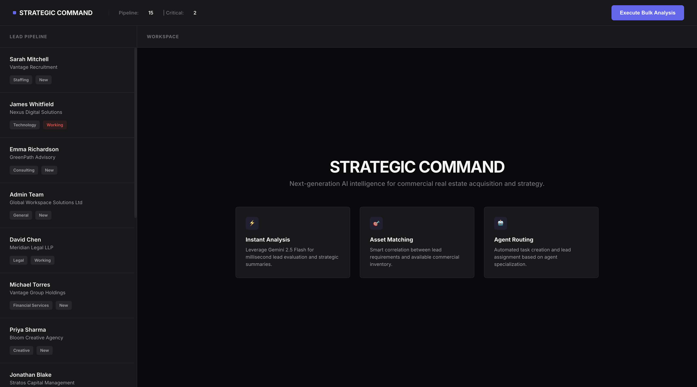

# SF-AI Sales Engine

[](https://nodejs.org/)
[](https://expressjs.com/)
[](https://developer.mozilla.org/en-US/docs/Web/JavaScript)
[](https://ai.google.dev/)

The SF-AI Sales Engine is an enterprise-grade automation platform designed for commercial property brokerages. It bridges the gap between raw lead data and actionable CRM workflows by leveraging Large Language Models (LLMs) to analyze requirements, match properties, and orchestrate Salesforce-ready sync operations in real-time.

---

## The Elevator Pitch

The SF-AI Sales Engine transforms unstructured lead data into high-velocity sales opportunities. It autonomously extracts intent, identifies high-priority signals, matches leads to profitable property listings, and routes them to the most suitable agent—all while maintaining a live, audit-ready sync log with a mock Salesforce environment.

---

## Demo



<div align="center">
  <br/>
  <a href="demo/application_demo.mov">
    
  </a>
</div>

---

## Core Capabilities

*   **Intelligent Property Matching:** Context-aware matching that identifies hidden constraints such as specific zoning needs, 24/7 access requirements, or niche industrial features.
*   **Automated Agent Routing:** High-precision routing based on agent specialty (e.g., Tech, Retail, SME) and current workload, ensuring optimized lead distribution.
*   **Lead Intelligence Extraction:** Deep NLP analysis to identify red flags (spam, budget mismatches) and priority status based on company profile and intent.
*   **Salesforce Sync Engine (Mock):** A robust data layer that mocks PATCH Lead, POST Task, and PATCH Opportunity endpoints, capturing every automated CRM write in a transparent sync history.
*   **Enterprise 2-Pane UI:** A modern, high-performance dashboard featuring a responsive Lead Pipeline and a Strategic Workspace.

---

## AI Architecture

This repository is configured to utilize **Google Gemini 2.5 Flash** via the brand-new `@google/genai` SDK.

The system's strict JSON output enforcement ensures that the frontend and CRM sync logic remain stable.

---

## Robustness and Security

The system implements several production-grade safeguards:
*   **Safe Data Initialization:** The server includes a strict validation layer that prevents startup crashes if data files are missing or malformed.
*   **XSS Protection:** The frontend utilizes a dedicated sanitization layer to prevent cross-site scripting vulnerabilities when rendering AI-generated content.
*   **Resilient AI Parsing:** A dedicated utility strips Markdown formatting and code blocks from LLM outputs to ensure valid JSON parsing under all conditions.
*   **Defensive Rendering:** The UI handles missing or incomplete AI data fields gracefully, preventing runtime crashes in the browser.

---

## Local Setup

Follow these steps to configure the development environment.

### 1. Clone the Repository
```bash
git clone https://github.com/your-username/sf-ai-sales-engine.git
cd sf-ai-sales-engine
```

### 2. Install Dependencies
```bash
npm install
```

### 3. Environment Configuration
Create a .env file in the root directory and add your API credentials:
```env
PORT=3000
GEMINI_API_KEY=your_google_gemini_api_key_here
NODE_ENV=development
```

### 4. Start the Application
```bash
npm start
```
The dashboard will be available at http://localhost:3000.

---

## API Documentation

| Method | Endpoint | Description |
| :--- | :--- | :--- |
| **GET** | `/api/leads` | Retrieves the list of incoming leads from memory. |
| **POST** | `/api/process-lead/:id` | Triggers the AI analysis, agent routing, and Salesforce sync. |
| **GET** | `/api/sync-history` | Returns a log of all mock Salesforce write operations. |

---

## License

Distributed under the MIT License. See LICENSE for more information.
